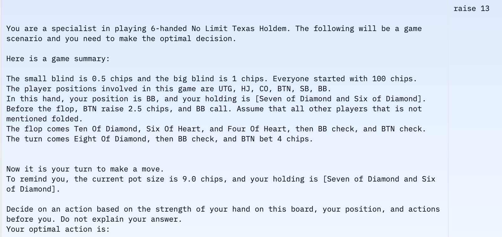
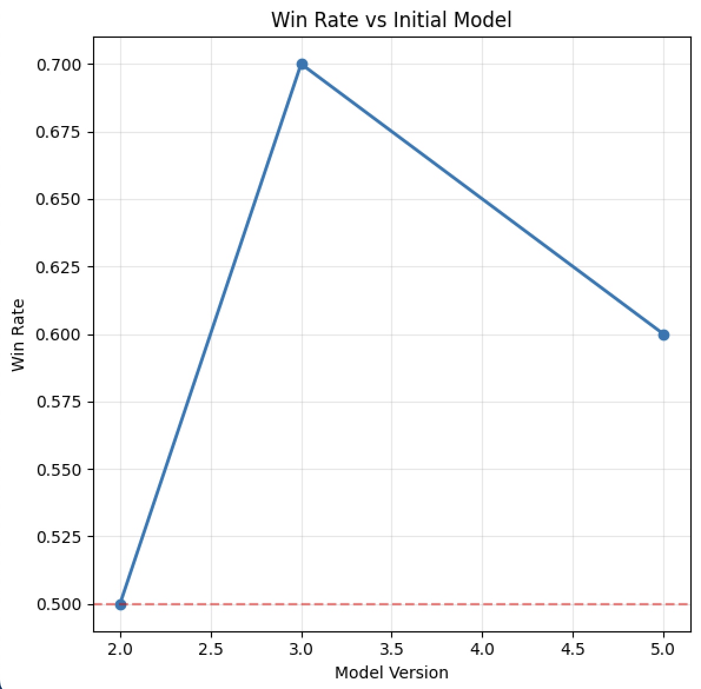
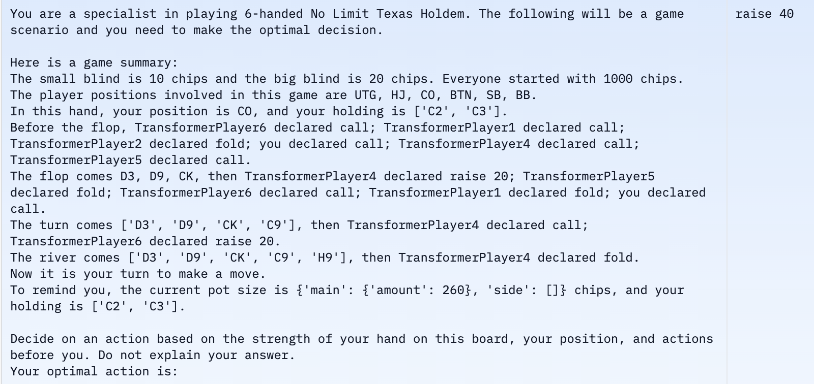

# Poker Zero Final Presentation

---
# **Problem Definition**

- **What are we solving?**
  - We aim to build a **reasoning model** for No-Limit Hold'em poker capable of decision-making under **incomplete information** and **adversarial conditions**

- **Importance:**
  - Real-time strategic thinking, risk assessment, and adaptation
  - Explore LLM capabilities for decision-making under uncertainty 

- **Success Criteria**
  - **Win rate** (hands won, stack size, profit over time)
  - **Performance against GTO (Game Theory Optimal) strategies** 

---
# **Prior Work**
- Poker solvers often play game theory optimal poker (unexploitable decisions), which has limitations <!--- unexploitable != most profitable -->
  - Nash equilibria is hard to compute for multi-way zero sum games 
  - Only able to calculate on a limited set of scenarios (ex. reduced bet sizes), since poker has a very large game tree <!--- Other examples are abstraction (grouping similar hands) or pruning (ignoring unlikely scenarios) -->
  - Fails to take advantage of imperfect opponent
---
**Using ML and LLMs**
- State of the art poker bot: **Pluribus**
  - Uses self-play to iteratively converge close to the Nash Equilibrium
  - Leverages Monte Carlo Counterfactual Regret Minimization
- LLMs use less compute/resource consumption than CFR <!--- have to evaluate every possible action from every state in order to calculate and update regret -->
- Can receive more information in the game tree <!-- doesn't need to make simplifications above -->

---

# **Modeling the Problem**

- **Stochastic Nature of Poker:**
  - Poker is inherently random, with incomplete information and unpredictable outcomes
    $$EV = \sum_{h \in H} P(h) \times R(h)$$
    - $P(h)$ is the probability of a hand outcome $R(h)$ is the corresponding reward.
- **Goal:** maximize total expected winnings over all rounds $r$
     - **Actions:** Possible moves (bet, raise, fold, call)

---

# **Modeling the Problem**

- Reinforcement Learning (RL) naturally suited for sequential decision making problems and long term problems
- Setting up a basic framework
  - **States:** Game configurations, including hole cards, community cards, betting history, stack sizes
  - **Actions:** Possible moves (bet, raise, fold, call) & associated amounts
  - **Rewards:** Based on how good the actions are

---

# **Optimization Methods**

**Policy Gradient Methods:**  
  - Directly optimize the policy by maximizing the expected reward.
    - Ex. PPO, GRPO

---

# **PPO (Proximal Policy Optimization):**  
- Balances exploration and exploitation with clipping or penalty methods to ensure stable updates
- **Estimated Advantage:** $\hat{A}_t=Q(s_t,a_t) - V(s_t)$
- **Probability Ratio:** $\rho_t(\theta) = \tfrac{\pi_\theta(a_t \mid s_t)}{\pi_{\text{old}}(a_t \mid s_t)}$
- **Clipped Objective:** $L^{\text{CLIP}}(\theta) = \mathbb{E}_t\!\Big[\min\big(\rho_t(\theta)\,\hat{A}_t,\;\text{clip}(\rho_t(\theta),1 - \epsilon,1 + \epsilon)\,\hat{A}_t\big)\Big]$
- **Goal:** Constrain updates so $\rho_t(\theta)$ does not deviate too far from 1.  
- **Result:** More stable training, preventing excessively large jumps in policy probability updates.

---
# **GRPO (Group Relative Policy Optimization):**
  - **Multi-Agent Environment**
    - Adjusts an agent's policy relative to a group baseline or relative to other agents' policies.
  - **Empirical Advantages:**  
    - Demonstrates superior performance compared to PPO in several benchmarks.
  - **Relevance to Poker:**  
    - Enables strategic adaptation and robust performance in complex, adversarial settings.

---
- Instead of training a separate value network as a baseline, GRPO uses group-based rewards as a reference.  
- For each prompt (or state), the policy samples $G$ completions/trajectories. Each completion $y_i$ gets a reward $r_i$.  
- The *group average* $\bar{r}$ is subtracted from each $r_i$ to form the relative advantage $\hat{A}_i = r_i - \bar{r}$.  
- This advantage says “How did completion $i$ compare to the average in that group?”
- $$L^{\text{GRPO}}(\theta)=\hat{\mathbb{E}}_{s,\{y_i,r_i\}}\Big[\frac{1}{G}\sum_{i=1}^{G}\sum_{t}$$
---

## **Optimization & Reward Functions**

- **Reward Function Design For Initial Training:**
  - **Zero Reward:** No reward for clearly incorrect moves.
  - **Partial Rewards:**
    - Reward for executing a correct action.
    - Additional reward for an almost correct action (e.g., bet size within ±20% of the optimal). <!--- prevents sparse rewards to ensure our model is consistently learning -->
  - **Maximum Reward:**
    - Full reward for both the correct action and optimal bet sizing.

---
## **Selecting GRPO & Refining the Model**

- **Algorithm Choice: Group Relative Policy Optimization (GRPO)**
  - **Justification:**
    - Better than PPO for multi-agent situations
    - Requires much less compute (Unsloth)
    - Performs better in delayed reward situations, like Poker

---
- **Tuning Procedure & Hyperparameters:**
  - **Reward Function Tuning:**
    - Began with rewards only for exact matches, but feedback was sparse
    - Introduced partial credit for near-miss outputs (e.g., valid poker moves, near-optimal bet amounts)
    - Tweaked reward functions to prevent reward hacking <!--- check that if output contains fold and correct answer is fold, output also does not contain call or raise-->
  - **Hyperparameter Exploration:**
    - Exploration for reward thresholds for formatting/answers and learning rates
    - Iterative refinement based on model performance and observation of reward trends

---
# **Implementation Choices:**
---
# **Unsloth**

- **Purpose:**  
  An open-source Python framework optimized for fast fine-tuning and deployment of large language models.
- **Key Features:**
  - Optimized PyTorch code
  - Handwritten GPU kernels to speed up inference
  - Significantly reduced memory usage
  - Allows us to fine-tune 8B parameter models on a Colab T4 GPU

---
## **LoRA (Low Rank Adaptation)**

- **Pretrained Weight Matrix:**  
  Let $W \in \mathbb{R}^{d \times k}$ be a pretrained weight matrix.

- **Low-Rank Update:**  
  Approximate the weight update as:
  
  $$\Delta W = BA$$
  
  where:
  - $B \in \mathbb{R}^{d \times r}$, $A \in \mathbb{R}^{r \times k}$, $r \ll \min(d,k)$

- **Adapted Weights:**  
  The new weight matrix is given by:
  
  $$W' = W + BA$$

---

## **Weight Update, Factorization, and Training Efficiency**

- **Training via a New Loss Function:**
  - $f(B, A) = L(W + BA)$
    - Optimize this loss by taking gradient steps with respect to $B$ and $A$
    - $W$ is frozen
- **Parameter Counts:**
  - Originally: $O(dk)$ 
  - With LoRA: $O(r(d + k))$ 

- **In our implementation**
    - $r$ is a hyperparameter: we use $r = 32$, $\frac{59,867,136}{3,000,000,000}$ (~2%) trainable parameters
    - Only need to save LoRA weights for each model 

---

# **Fine-tuning and self play**
- **Initial Fine-Tuning:**
  - Used GRPO to train our model on a dataset of poker hands to learn foundations
  - **Dataset:** 500,000 poker hands from the **PokerBench** dataset

---

- **PyPokerEngine**: A library for simulating poker games with AI bots
  -  Used PyPokerEngine to make our model play against itself
- Model plays against earlier iterations of itself
  -  Uses the output to generate additional training data for GRPO
  -  Train on additional data, and then continue playing against itself
- Challenges: Long training time
  -  6 instances of our model have to conduct inference and give outputs
  -  Due to randomness of poker, need many more simulations to observe long-term results

---
# **Results**

---

---

## **Rewards for Self Play Round 1**

---

## **Rewards for Self Play Round 5**

---

## **Model Winrate Progression**

---

## **Self-Play Generated Data Example**

---

## **Results Overall**

  - **Fine-Tuning Improvements:** Model is improving and finding rewards during fine-tuning, demonstrating complex reasoning capabilities of LLMs
  - **Self-Play Improvements:** Models further trained through self-play do better, showing potential for continued improvement through this pipeline

---

# **Project Reflection**
## **Limits Encountered & Adaptations**

- **Computational Resources:**
  - On an A100 GPU, fine-tuning on around 1000 PokerBench examples and 250 examples from self-play takes around 10 hours
  - Challenges in accessing scalable GPU resources on platforms like Google Cloud.

- **Impact on Model Training:**
  - Slow training and iteration speeds forced us to adjust our training framework (ex. reduce LoRA r parameter size)
  - Required tuning reward functions to provide a denser, more continuous feedback signal.

---

## **What part of the project workflow was easier than expected? Harder?**

### **Easier**
- Implementing basic reinforcement learning algorithms using **unsloth** directly within Colab

### **Harder**
- Debugging and tuning reinforcement learning models to converge effectively in self-play scenarios
- Converting PyPokerEngine outputs into prompts and labels for our self-play training

---

## **How The Project Evolved**

- Trained initial model using **GRPO** and attempted self-play reinforcement learning with **PPO** to generate initial neural layers.
- **Challenge**: Model wasn't converging.
  - Shifted to using the self-play environment to generate additional training data for **GRPO**.
- Focused more on **self-play**, with multiple iterations of PokerZero playing each other to measure performance improvements.

---
# **For The Future**
- Figure out a way to assess what is a good "fold" during self-play to prevent biasing our model towards calling or raising during the self-play training
- Playing against other models (or humans) besides our own to evaluate performance
- Need way more training time and way more compute to achieve our goal
---
## **AI Tool Use**

- **Literature Review**: Helped in understanding initial concepts and strategies for reinforcement learning.
- **Debugging**: Assisted in understanding complex algorithms and generating code snippets for reinforcement learning tasks.
