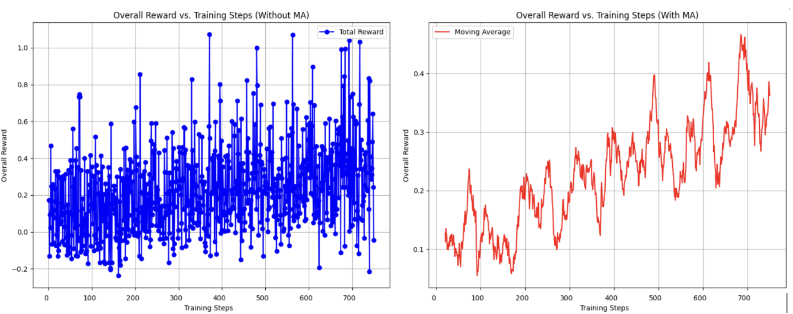

# Poker Zero Final Presentation

---
# **Problem Definition**

- **What are we solving?**
  - We aim to build a **reasoning model** for No-Limit Hold’em poker capable of decision-making under **incomplete information** and **adversarial conditions**.

- **Importance:**
  - Real-time strategic thinking, risk assessment, and adaptation.
  - Decision-making under uncertainty 

- **Success Criteria**
  - **Win rate** (hands won, stack size, profit over time)
  - **Performance against GTO (Game Theory Optimal) strategies** 

---
# **Prior Work**
- Poker solvers often play game theory optimal poker, which is limited
  - Nash equilibria is hard to compute for multi-way zero sum games 
  - Only able to calculate on a limited set of scenarios, since poker has a very large game tree
  - Won't take advantage of imperfect opponent
---
**Using ML and LLMs**
- State of the art poker bot: **Pluribus**
  - Uses self-play to iteratively converge close to the Nash Equilibrium
  - Leverages Monte Carlo Counterfactual Regret Minimization
- Transformer models like ChatGPT / GPT-4 also don't play GTO
- LLMs use less compute/resource consumption than CFR
- Can receive more information in the game tree

---

# **Modeling the Problem**

- **Stochastic Nature of Poker:**
  - Poker is inherently random, with incomplete information and unpredictable outcomes
    $$EV = \sum_{h \in H} P(h) \times R(h)$$
    - $P(h)$ is the probability of a hand outcome $R(h)$ is the corresponding reward.
- **Goal:** maximize total expected winnings over all rounds $r$
     - **Actions:** Possible moves (bet, raise, fold, call)

---

# **Modeling the Problem**

- Reinforcement Learning (RL) naturally suited for sequential decision making problems and long term problems
- Setting up a basic framework
  - **States:** Game configurations, including hole cards, community cards, betting history, stack sizes
  - **Actions:** Possible moves (bet, raise, fold, call) & associated amounts
  - **Rewards:** Based on how good the actions are

---

# **Optimization Methods**

- **Policy Gradient Methods:**  
  Directly optimize the policy by maximizing the expected reward.

- **PPO (Proximal Policy Optimization):**  
  Balances exploration and exploitation with clipping or penalty methods to ensure stable updates.
---
- **GRPO (Group Relative Policy Optimization):**
  - **Monotonic Improvement:**  
    Provides theoretical guarantees for steady policy improvement.
  - **Reward-Centric Updates:**  
    Focuses on adjusting policies based on long-term reward estimates.
  - **Empirical Advantages:**  
    Demonstrates superior performance compared to PPO and TRPO in several benchmarks.

- **Relevance to Poker:**  
  Enables strategic adaptation and robust performance in complex, adversarial settings.

---

# **Unsloth**

- **Purpose:**  
  An open-source Python framework optimized for fast fine-tuning and deployment of large language models.
- **Key Features:**
  - High-performance PyTorch code with haT4 or A100written GPU kernels.
  - Improved memory utilization through typecasting.
  - Scalability: Fine-tuning 8B parameter models on modest GPU setups (e.g., Colab T4).
---
## **LoRA (Low Rank Adaptation)**
- **Concept:**  
  Introduces low-rank matrices into pretrained model layers to achieve efficient fine-tuning.
- **Benefit:**  
  Significant performance gains with a minimal increase in parameters—ideal for adapting large models in resource-constrained environments.

---

## **Mathematical Formulation of LoRA**

- **Pretrained Weight Matrix:**  
  Let $W \in \mathbb{R}^{d \times k}$ be a pretrained weight matrix.

- **Low-Rank Update:**  
  Approximate the weight update as:
  
  $$\Delta W = BA$$
  
  where:
  - $B \in \mathbb{R}^{d \times r}$, $A \in \mathbb{R}^{r \times k}$, $r \ll \min(d,k)$

- **Adapted Weights:**  
  The new weight matrix is given by:
  
  $$W' = W + BA$$

---

## **Optimization & Reward Functions**

- **Reward Function Design:**
  - **For Initial Training:**
    - **Negative Reward:** Apply penalties for outputs that violate constraints.
    - **Zero Reward:** No reward for clearly incorrect moves.
  - **Partial Rewards:**
    - Reward for executing a correct action.
    - Additional reward for an almost correct action (e.g., bet size within ±20% of the optimal).
  - **Maximum Reward:**
    - Full reward for both the correct action and optimal bet sizing.
---
- **Why This Approach?**
  - Allows gradual, nuanced learning instead of an all-or-nothing reward.
  - Helps the model learn the subtleties of decision-making in an environment where perfect play is rare.

---
## **Selecting GRPO & Refining the Model**

- **Algorithm Choice: Guaranteed Reward Policy Optimization (GRPO)**
  - **Justification:**
    - GRPO provides theoretical guarantees for steady policy improvement.
    - Suitable for poker's continuous and complex environment where isolated wins do not ensure overall success.

---
- **Tuning Procedure & Hyperparameters:**
  - **Reward Function Tuning:**
    - Began with rewards only for exact matches, but feedback was sparse.
    - Introduced partial credit for near-miss outputs (e.g., valid poker moves, near-optimal bet amounts).
  - **Hyperparameter Exploration:**
    - Systematic grid search over reward thresholds and learning rates.
    - Iterative refinement based on model performance and stability.

---
- **Implementation Choices:**
  - Leveraged the **Unsloth** framework to optimize GRPO training.
  - Utilized PyTorch for model development and integration, taking advantage of its efficient computation and GPU support.

---

# **Limits Encountered & Adaptations**

- **Computational Resources:**
  - Initially limited to a T4 GPU on Colab, leading to frequent disconnections and slow iteration.
  - Challenges in accessing scalable GPU resources on platforms like Google Cloud.

- **Impact on Model Training:**
  - Slow training and iteration speeds forced us to adjust our training framework.
  - Required tuning reward functions to provide a denser, more continuous feedback signal.

---
- **Adaptation Strategies:**
  - **Unsloth** played a critical role in speeding up our training cycles.
  - Optimization of training loops and hyperparameter searches to work within computational constraints.
  - Adoption of incremental learning strategies to mitigate resource limitations while still aiming for optimal performance.

---

# **Results**

---

---

## **Rewards for Self Play Round 1**

---

## **Rewards for Self Play Round 5**

---

## **Results Overall**

- **Profit Rate:** Consistent improvement in win rates against older iterations of the models

How do your results compare to baseline methods or the literature?

- **Performance Metrics:**
  - **Reward Rate:** Upward trend of rewards over time

---

# **Demo**

Showcase a demo or compelling visualization if applicable.

Compare expected progress with actual progress. Explain discrepancies.

---

# **Project Reflection**

## **Technical/Conceptual difficulties**

- Understanding the complexity of poker strategies and how to model them effectively.
- Implementing reinforcement learning algorithms, especially in the context of self-play.

---

## **What part of the project workflow was easier than expected? Harder?**

### **Easier**
- Implementing basic reinforcement learning algorithms using **unsloth** directly within Colab.

### **Harder**
- Debugging and tuning reinforcement learning models to converge effectively in self-play scenarios.

---

## **How the project evolved**

- Trained initial model using **GRPO** and attempted self-play reinforcement learning with **PPO** to generate initial neural layers.
- **Challenge**: Model wasn't converging.
  - Shifted to using the self-play environment to generate additional training data for **GRPO**.
- Focused more on **self-play**, with multiple iterations of PokerZero playing each other to measure performance improvements.

---

## **How did AI tools assist your project?**

### Specific Examples:
- **Literature Review**: Helped in understanding initial concepts and strategies for reinforcement learning.
- **Debugging**: Assisted in understanding complex algorithms and generating code snippets for reinforcement learning tasks.
