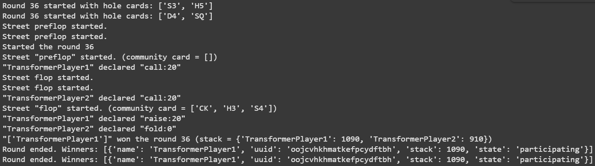

# Poker Zero Lightning Presentation
---
# **Problem Statement and Motivation**

## **Objective**
Develop a reasoning model optimized for **no-limit hold’em poker**. Success in poker extends beyond monetary gain—it signifies advancements in:
- **Reasoning under incomplete information**
- **Adversarial decision-making**
- **Strategic adaptation**
---
## **Applications**
Poker AI has significant implications in:
- **Game Theory** 
- **Economic Modeling** 
- **Negotiation** 

## **Prior Work**
Several notable AI-driven poker models include:
- **Poker Bench** – Trained LLMs to become professional poker players
- **PokerGPT** – Lightweight solver leveraging a large language model
- **Pluribus** – Demonstrated multiplayer, near-GTO strategies

---
#### Data
| **Instruction** | **Output** |
|---------------|-----------|
| **You are a specialist in playing 6-handed No Limit Texas Hold’em.** The following will be a game scenario, and you need to make the optimal decision.  | Bet 18
| **Game Summary:** 
| - Small Blind: **0.5 chips**  
| - Big Blind: **1 chip**  
| - Everyone started with **100 chips**  
| - Player positions: **UTG, HJ, CO, BTN, SB, BB**  
| - **Your Position:** HJ  |
| - **Your Hand:** [King of Diamond, Jack of Spade]  
| **Pre-Flop Action:** |
| - HJ raises **2.0 chips** |
| - BB calls |
| - All other players folded |
| **Post-Flop Action:** |
| - [Details of post-flop play...] |
| **River:** *Seven of Clubs* |
| - BB checks |
| **Your turn to act.** Your optimal action is: | **[Your Decision Here]** |

---
## Technical Approach

### Unsloth and GRPO

Unsloth is an open-source Python framework that speeds up the process of fine-tuning and accessing large language models (LLMs). It does so through the following methods:
Optimized Computation Kernels
Memory Efficiency and Reduced Overhead
Integrated Fast Inference

How We Use It: 

GRPO (Group Relative Policy Optimization), developed by DeepSeek, trains a model to optimize a reward function instead of training a model solely on next-token prediction (which simply teaches it to mimic data). Through group-based comparison, scoring, and relative reinforcement, this process helps the model learn the underlying reasoning process and not just the final answer. 

How We Use It: 

---
### LoRA

### **Low Rank Adaptation (LoRA)** is a method for fine-tuning large models efficiently.
- It works by introducing low-rank matrices into pretrained model layers. 
- This approach allows significant performance gains with a minimal number of additional parameters. 

---

### Mathematical Formulation of LoRA 
- **Pretrained Weight Matrix:** Let  $W \in \mathbb{R}^{d \times k}$ be a pretrained weight matrix. 
- **Low-Rank Decomposition:** LoRA approximates the weight update $\Delta W$ as: $\Delta W = BA$
where: 
- $B \in \mathbb{R}^{d \times r}$
- $A \in \mathbb{R}^{r \times k}$
- $r \ll \min(d, k)$
- **Adapted Weights:** The updated weight matrix becomes: $W' = W + BA$
 --- 

### PyPokerEngine
---
## Initial Results
- **Unsloth:** Successfully fine tuned our model in Colab
- **PyPokerEngine:** Used PyPokerEngine to make our model play against itself

---

## Next Steps

### PyPokerEngine
- **More Players** Poker environment is only heads up (2 players). Our goal is to play 6 handed, which would have more interesting applications because heads-up Texas Hold’em is a solved game

### Additional Training
- **Self-Play** Model competes against previous versions, gradual improvement and adaptation to exploitative strategies
- **Training Pipeline** Feed data back into our model for reinforcement learning training. Eliminates need for a premade dataset and allows the model to learn optimal strategies by itself

---

## Thank You!
Questions?
